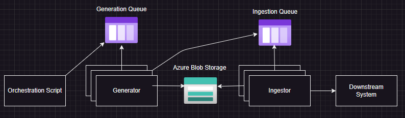
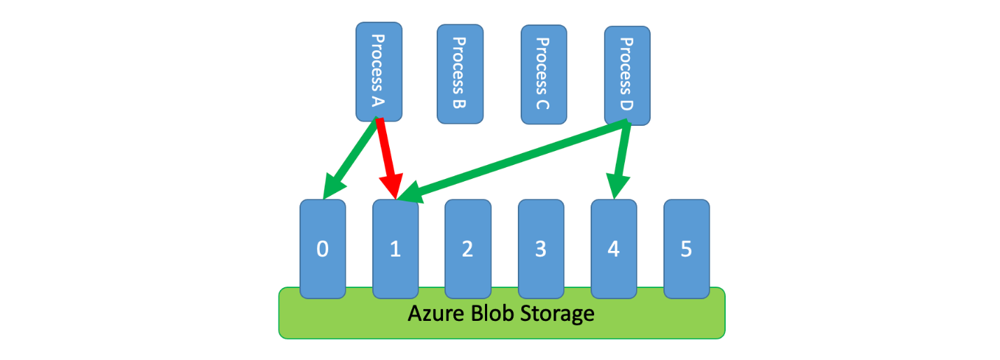

# Start Simple, Scale Fast: Azure Storage for Distributed Computing

## Introduction

Have you ever needed to create a distributed system? Maybe you want the performance of splitting your workload across many container instances. Or maybe you need to ensure resiliency if any of those instances fatally crash. In any case, there are many solutions on Azure for accomplishing your scalability and resiliency goals for your system. Azure Storage Accounts are one of the simplest resources on Azure, but simultaneously one of the most useful, and reused building blocks across the Microsoft Cloud ecosystem. Blobs, leases, and queues are fundamental components that enable powerful patterns. Let's dig into why you should have Storage Accounts ready to go in your Azure toolbelt.

## Provisioning your Storage Account

The Storage Account resource contains multiple utilities, including Blob Storage and Queue Storage. There are other facets, such as File Shares and Tables that are outside of the scope of this article.

There are two SKUs, Standard and Premium.

Standard should be your default choice, however you may need Premium depending on your use-case.
Premium storage accounts leverage SSDs (Solid State Drives) which provide faster read and write performance than traditional Hard Drives.
Consider premium for the following scenarios:
- fast and consistent latency of input and output
- high input and output operations per second
[Read more about Premium Storage Accounts](https://learn.microsoft.com/en-us/azure/storage/blobs/storage-blob-block-blob-premium)

## Blob Storage

Blob storage is used for storing unstructured data, such as text or binary data.

There are three types of blobs.
- Block blobs: optimized for uploading large amounts of data efficiently.
- Page blobs: optimized for random reads and writes. Used as storage for Virtual Machines.
- Append blobs: optimized for appends, data is appended to the end of the blob, and avoids race conditions for concurrent appends.

Block blobs and Append blobs are typically used for distributed workloads.

[Read more about the different blob types](https://learn.microsoft.com/en-us/rest/api/storageservices/understanding-block-blobs--append-blobs--and-page-blobs)

### Distributed Mutex via Leasing Blobs

Any blob can be leased for exclusive write access. While its leased, competing processes cannot lease that blob. This effectively becomes a distributed Mutex. This is useful for any resource that is only safe for one process to access at a time.

Using a distributed mutex enables you to accomplish multiple patterns within a distributed system; including but not limited to, the following:
- Shared Data: Protecting a shared read/write data source, such as a database.
- Service Coordination: For orchestrating distributed services that should not be running concurrently or need to be run in a specific order.
- Leader Election: Having multiple processes select a single leader. First to lease the blob in this case.
- Throttling: Using blobs as a representation of the throughput limits of a database, then distributing those leased blobs to processes to limit the usage of limited resources.

[Create and Manage blob leases with .NET](https://learn.microsoft.com/en-us/azure/storage/blobs/storage-blob-lease)

### Append Blob as a Data Sink

Multiple processes can safely write to the same append blob, making it a nice data sink.
It's good to know though that append blobs are limited to 50,000 blocks, AKA 50,000 writes, since each write is a block.
The data is generally orderd in a first-in, first-out way, but if multiple processes are writing as soon as they can, the data will be unordered.

Some example scenarios for append blobs include the following:
- Log Files: Writing logs out to append blobs in batches for archival.
- Event Sourcing: Useful for tracking a system's state over time.
- Data Aggregation: Many processes outputting to a single source, unordered.

## Queue Storage

Both Standard and Premium Storage Account SKUs support Azure Queue Storage.

Within the Storage Account, each queue needs a unique name. [Naming Queues and Metadata](https://learn.microsoft.com/en-us/rest/api/storageservices/naming-queues-and-metadata)

There are many use-cases for a distributed queue, but here's a simple one: distributing work items across many compute instances. Simply load the messages into the queue, and then have the processes consume those messages. There are some key benefits to this approach:
- Resilience: If a message fails to process, it will re-appear in the queue after a time. The number of times this can occur is configurable. Additionally, deadletter queues should be used, and are described in the section below.
- Greedy Processes: Each instance can get more work as it finishes work, and the queue prevent race conditions for dequeueing messages

### Deadletter Queues
Deadletter queues are for collecting messages that can't be processed, or failed in a system (after some number of retries) for some reason.
Although Queue Storage doesn't support dead-letter queues out of the box, they can still be implemented by the services that are using the queue.
Simply create a `x-deadletter` queue, and write the logic for sending messages there. Be advised that the default message retention for a queue is 7 days.

Deadletter queues are useful for detecting issues with your system. Sometimes the message itself is a problem, but more often a piece of the system has failed, failing the message.

### Need more performance?
Storage Queue may not have enough performance or lack the features to suit your requirements. In that case, take a look at Service Bus queues.
[Read more about comparing Storage queues with Service Bus queues](https://learn.microsoft.com/en-us/azure/service-bus-messaging/service-bus-azure-and-service-bus-queues-compared-contrasted)

## Example 1: Multi-stage Distributed Workload

Consider a two-stage workload. Generation of synthetic data, and Ingestion of that data into another system.

The generation work can be segmented into work units, and defined as queue messages that generator processes receive and do work on.

The ingestion work likewise can be segmented into work units, and references the generated data using the message.

Append blobs come into play here as well. As the generator generates data, and as the ingestor ingests, they can append metadata like IDs to a file, which can later be used to reference that data in the downstream system.

Using queues for both stages of the workload enables the following benefits:
- Distributed work across many workers
- Resilience to failures
- Introspection into the system via Blob storage, and the queues themselves (including manually created deadletter queues)

## Example 2: Blob Leases for Rate-Limiting

Consider a system that needs to rate-limit requests to a database. The database has a limited number of connections and capacity and the system needs to ensure that it doesn't exceed that limit.

Distributing the limited resources among many processes is a good way to scale the system, but how do you ensure that the processes don't exceed the limit?

Blob leases can be used to represent the limited resources, and then distributed to the processes. The processes lease the blobs, and then release them when they are done. If a process fails, the blob will be released after a time, and can be leased by another process.

[Rate Limiting Cloud Design Pattern: Azure Architecture Center](https://learn.microsoft.com/en-us/azure/architecture/patterns/rate-limiting-pattern)

## Key Takeaways
- Azure Storage Accounts: A foundational resource for building scalable and resilient distributed systems. The versatility of Storage Accounts makes them a crucial tool in your Azure toolkit.

- Blob Storage: Useful for handling unstructured data and comes in three types: Block blobs, Page blobs, and Append blobs. Each type is optimized for specific use-cases, from efficiently uploading large files, to serving as the backend storage for VMs, to effienctly appending data to a single blob.

- Distributed Mutex via Blob Leasing: Azure Blobs can be leased for exclusive write access, enabling the implementation of distributed mutexes for resource coordination, leader election, and safeguarding shared data.

- Append Blob Limitations: While append blobs serve as excellent data sinks for multiple processes, they have a block limit of 50,000 writes and do not inherently provide data ordering.

- Queue Storage: An efficient way to distribute work across multiple compute instances. Although unaffected by the Storage Account SKU, Queue Storage's performance may not meet all use-case requirements.

- Deadletter Queues: While not a native feature of Azure Queue Storage, deadletter queues can be manually implemented to handle messages that fail to process after a certain number of attempts.

- Premium vs Standard Storage Accounts: Premium Storage Accounts provide higher performance but at a greater cost. Choose the SKU based on your application's specific needs.

- Alternatives for Higher Performance: If Azure Queue Storage doesn't meet your performance or feature needs, consider using Azure Service Bus queues.

Remember, Azure offers a plethora of options for achieving scalability and resilience in your distributed systems. Starting with Storage Accounts gives you a versatile set of tools that can adapt as your needs evolve.
